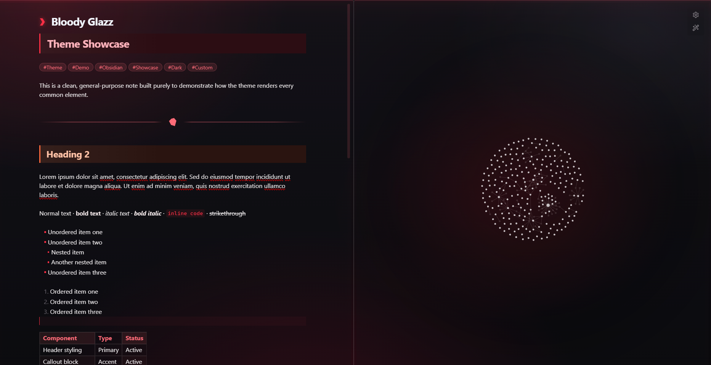
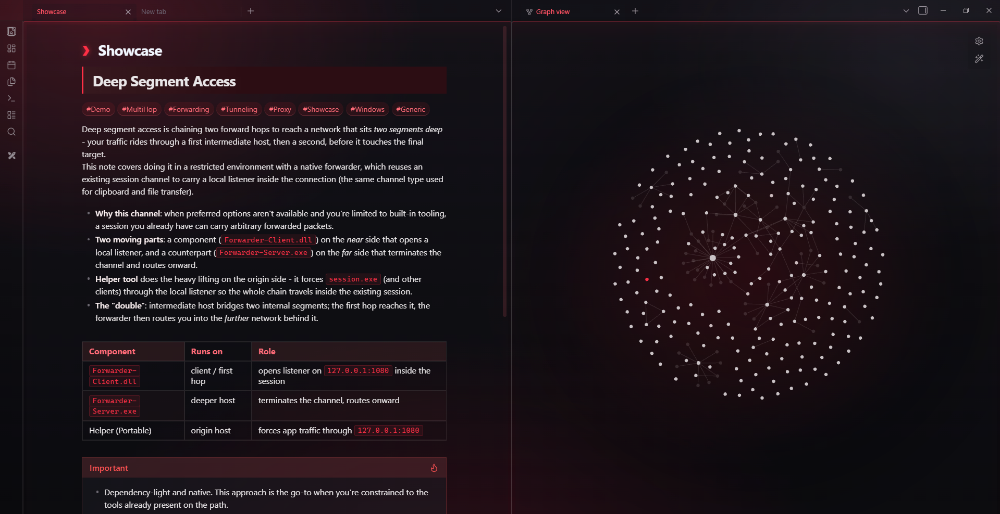
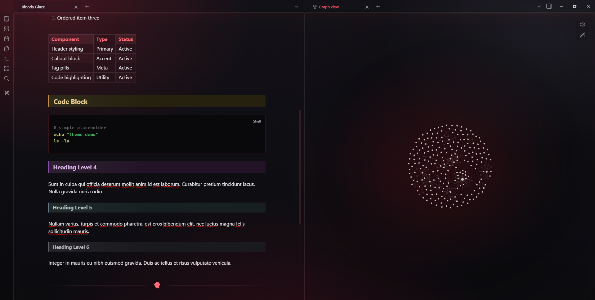
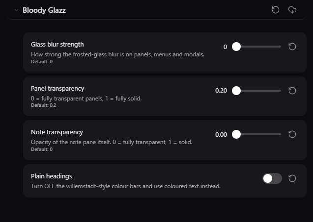

# Bloody Glazz

A dark frosted-glass Obsidian theme with crimson terminal accents, colored heading bars, and a clean gem divider.

## Screenshots

**Reading Mode**

**Live Preview / Editor**

## Features

- Canvas with soft crimson
- Frosted glass panels
- Adjustable glass blur and transparency via Style Settings plugin
- Six different colored heading bars (From heading 1 to heading 6)
- Crimson terminal-style inline code and code blocks
- Gem-style horizontal rule divider
- Tag pills, tables, and blockquotes tuned for the darker and crimson look

## Installation

### Recommended
1. Open Obsidian
2. Go to **Settings → Appearance → Themes → Manage**
3. Search for **"Bloody Glazz"** and install the theme

### Manual Installation
1. Download the latest release assets (`manifest.json` + `theme.css`)
2. Create folder: `.obsidian/themes/Bloody Glazz/`
3. Place both files inside that folder
4. Reload Obsidian and enable the theme in **Settings → Appearance**

## Recommended Settings via Style Settings

## Author

**SAsecurityN**  
[GitHub](https://github.com/SAsecurityN)

## License

MIT
